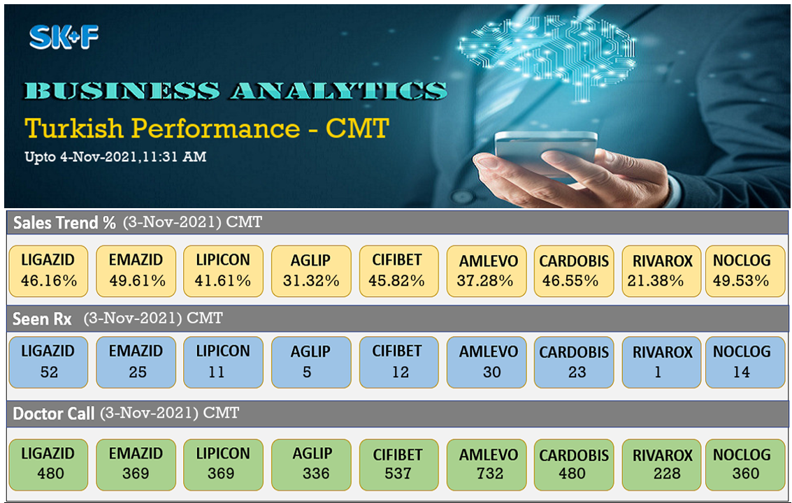
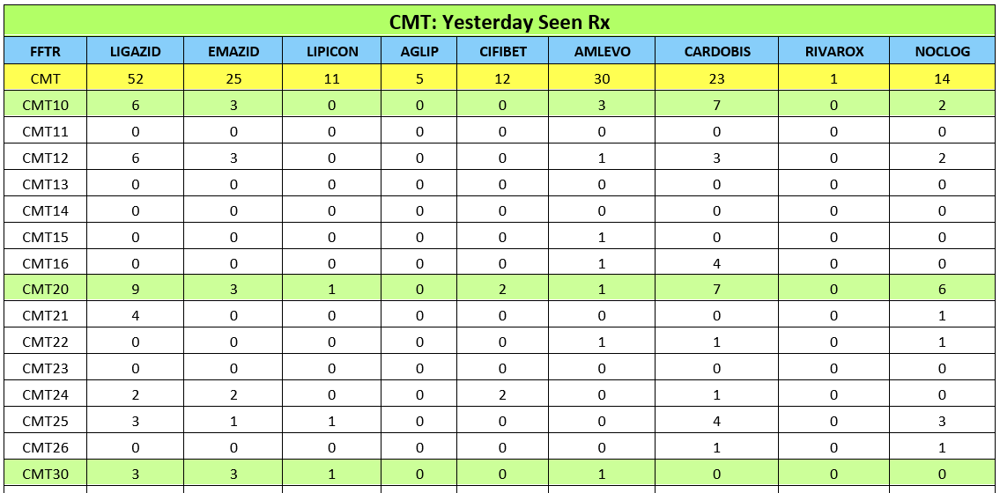
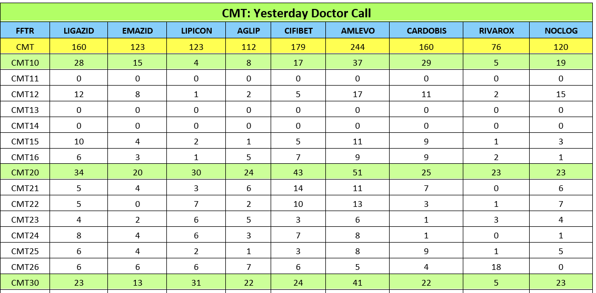

# 📊 Pharma Sales Reporting Automation

### (SeenRx • Doctor Call • Sales Trend Analysis)



---

## 🔍 Overview

This project automates the generation of **field-force sales performance reports** using Python.

It processes raw data, generates KPI visualizations, and creates **PowerPoint reports** for:

* 📈 Sales Trend %
* 💊 Seen Rx Performance
* 👨‍⚕️ Doctor Call Analysis
* 🎯 Sales Achievement %

The goal is to **reduce manual reporting effort** and improve visibility into sales performance metrics.

---

## ⚙️ Tech Stack

* **Python** (Pandas, NumPy)
* Data Processing & Automation
* KPI Visualization (Matplotlib)
* PowerPoint Report Generation
* Email Automation (SMTP)
* PyInstaller (Executable Packaging)

---

## 📂 Project Structure

```
FF_Wise_SeenRx_Call_SalesTrend/
│── main.py
│── main.spec
│── requirements.txt
│
├── AdditionalFiles/
│   ├── generate_raw_data.py
│   ├── all_kpi_image.py
│   ├── send_all_mail.py
│
├── images/
│   ├── banner_kpi.png
│   ├── sales_trend_preview.png
│   ├── seen_rx_preview.png
│   ├── doctor_call_preview.png
│   └── sample_data_look.png
│
├── output/
│   └── FF_Wise_SeenRx_Call_SalesTrend_Sample_Report.pptx
```

---

## 📊 Dashboard Preview

### 📈 Sales Trend


### 💊 Seen Rx



### 👨‍⚕️ Doctor Call



---

## 📥 Sample Output

👉 [Download Sample PowerPoint Report](output/FF_Wise_SeenRx_Call_SalesTrend_Sample_Report.pptx)

---

## 🚀 How to Run

### 1. Clone the repository

```bash
git clone https://github.com/YOUR_USERNAME/FF_Wise_SeenRx_Call_SalesTrend.git
cd FF_Wise_SeenRx_Call_SalesTrend
```

### 2. Install dependencies

```bash
pip install -r requirements.txt
```

### 3. Run the project

```bash
python main.py
```

---

## ⚡ Features

* ✅ Automated data processing pipeline
* ✅ KPI image generation
* ✅ PowerPoint report automation
* ✅ Email-based report distribution
* ✅ Scalable for multiple regions

---

## 🔐 Data Privacy Note

All data, emails, and business information in this repository are **sample/demo only**.

No real company or confidential data is included.

---

## 💼 Resume Impact

**Built an end-to-end Python automation system to generate KPI dashboards and PowerPoint reports for sales trend and field-force performance analysis, improving reporting efficiency and reducing manual effort.**

---

## ⭐ Future Improvements

* Add interactive dashboard (Power BI / Tableau)
* Deploy as web application (Streamlit)
* Schedule automation using Airflow or cron jobs
* Cloud integration (AWS / Azure)
